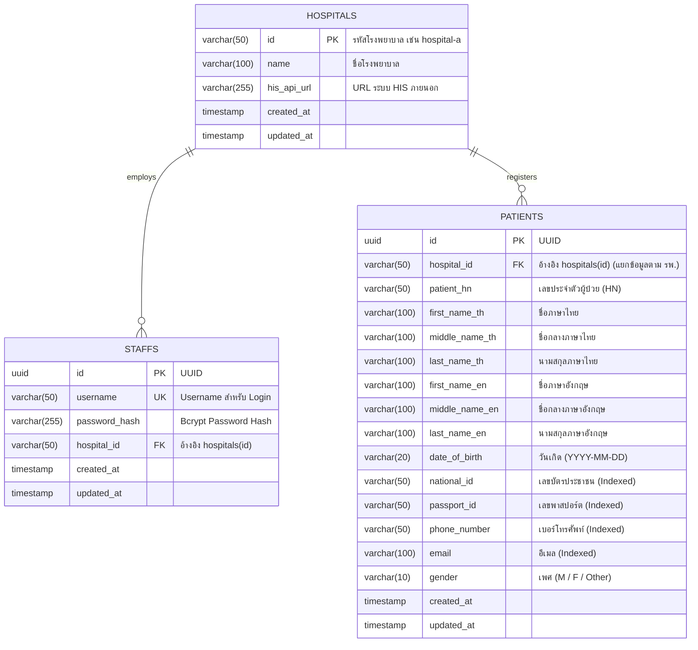

# Hospital Middleware System (ระบบมิดเดิลแวร์โรงพยาบาล)

ระบบ Middleware สำหรับเชื่อมต่อและสืบค้นข้อมูลผู้ป่วยจากระบบสารสนเทศโรงพยาบาล (Hospital Information System - HIS) พัฒนาขึ้นสำหรับ **Agnos Candidate Assignment**

พัฒนาด้วย **Go (Golang)**, **Gin Framework**, **PostgreSQL**, **Docker** และ **Nginx**

---

## 🔗 ลิงก์เอกสารและการส่งมอบงาน (Deliverables Links)

| รายการส่งมอบ (Deliverable) | ลิงก์ / ตำแหน่งไฟล์ |
|---|---|
| 📄 **Google Doc (Development Planning Document)** | [คลิกเพื่อดู Google Doc](https://docs.google.com/document/d/1dKuPOS-yhGq-jd-ldUqNdbdeTjcWOtDn-pI5mvGL-Hs/edit?usp=sharing) |
| 📦 **GitHub Repository** | [https://github.com/SaharatRachanaum/his-backend-candidate-assignment](https://github.com/SaharatRachanaum/his-backend-candidate-assignment) |
| 📑 **ไฟล์เอกสารสำรอง (PDF)** | [`docs/Agnos Candidate Assignment - Development Planning Documentation.pdf`](docs/Agnos%20Candidate%20Assignment%20-%20Development%20Planning%20Documentation.pdf) |
| 📝 **ไฟล์เอกสารสำรอง (Word .docx)** | [`docs/Agnos Candidate Assignment - Development Planning Documentation.docx`](docs/Agnos%20Candidate%20Assignment%20-%20Development%20Planning%20Documentation.docx) |
| 🖼️ **แผนภาพฐานข้อมูล (ER Diagram Vector SVG)** | [`docs/er_diagram.svg`](docs/er_diagram.svg) *(หลัก - สวยคมชัด Vector)* |
| 🖼️ **แผนภาพฐานข้อมูล (ER Diagram Image PNG)** | [`docs/er_diagram.png`](docs/er_diagram.png) *(สำรอง)* |
| 📬 **Postman Collection** | [`docs/postman_collection.json`](docs/postman_collection.json) |

---

## 📋 สารบัญ (Table of Contents)
1. [Tech Stack](#-tech-stack)
2. [สถาปัตยกรรมและฟีเจอร์หลัก (Key Features & Architecture)](#-สถาปัตยกรรมและฟีเจอร์หลัก)
3. [โครงสร้างโปรเจค (Project Structure)](#-โครงสร้างโปรเจค-project-structure)
4. [วิธีการรันระบบด้วย Docker Compose (Quick Start)](#-วิธีการรันระบบด้วย-docker-compose)
5. [Database Schema & ER Diagram](#-database-schema--er-diagram)
6. [API Documentation & ตัวอย่างการใช้งาน](#-api-documentation--ตัวอย่างการใช้งาน)
7. [การรัน Unit & Integration Tests](#-การรัน-unit--integration-tests)
8. [Postman Collection](#-postman-collection)

---

## 🛠 Tech Stack
- **ภาษา**: Go (เวอร์ชัน 1.24+)
- **เว็บเฟรมเวิร์ก**: Gin Web Framework (`github.com/gin-gonic/gin`)
- **ORM / Database Driver**: GORM ร่วมกับ PostgreSQL Driver (`gorm.io/gorm`, `gorm.io/driver/postgres`)
- **ฐานข้อมูล**: PostgreSQL 16
- **Reverse Proxy**: Nginx (Alpine)
- **Containerization**: Docker & Docker Compose
- **การยืนยันตัวตน (Auth)**: JWT (`github.com/golang-jwt/jwt/v5`) และการเข้ารหัสรหัสผ่านด้วย Bcrypt

---

## 🏛 สถาปัตยกรรมและฟีเจอร์หลัก

- **Clean / Layered Architecture**: แยก Layer ชัดเจนตามหลักการ Clean Architecture (`cmd`, `domain`, `repository`, `service`, `handler`, `middleware`, `pkg`) ทำให้อ่านง่าย ขยายต่อง่าย และทดสอบได้สะดวก
- **Multi-Tenant Data Isolation**: เจ้าหน้าที่ (Staff) จะถูกผูกกับโรงพยาบาลที่สังกัด และเมื่อค้นหาข้อมูลผู้ป่วย ระบบจะล็อคขอบเขตให้เข้าถึงได้เฉพาะผู้ป่วยในโรงพยาบาลเดียวกันเท่านั้น
- **HIS Adapter Layer**: มี Adapter สำหรับเชื่อมต่อ Hospital A API (`GET https://hospital-a.api.co.th/patient/search/{id}`) พร้อมรองรับการ Sync และแคชข้อมูลลงฐานข้อมูลอัตโนมัติ
- **Nginx Reverse Proxy & Security**: Nginx ทำหน้าที่เป็น Front-facing Proxy รับ Request ที่ Port 80 ส่งต่อไปยัง Go Backend (Port 8080) พร้อมใส่ Security Headers และ Gzip Compression
- **Unit Test Coverage สูง**: มี Unit Test ครอบคลุมทั้ง Positive และ Negative scenarios เช่น การตรวจสอบ Auth, การล็อคสิทธิ์แยกโรงพยาบาล, การสืบค้นข้อมูลตามฟิลด์ต่างๆ, และ Mock HIS API

---

## 📁 โครงสร้างโปรเจค (Project Structure)

```
.
├── cmd/
│   └── server/
│       └── main.go                 # จุดเริ่มต้นของระบบ (Entrypoint) & Graceful Shutdown
├── internal/
│   ├── client/
│   │   └── his/                    # ตัวเชื่อมต่อระบบสารสนเทศโรงพยาบาล (HIS Adapters)
│   │       ├── client.go           # HIS Interface & Factory
│   │       ├── hospital_a.go       # Adapter เชื่อมต่อ Hospital A API
│   │       ├── hospital_a_test.go  # Unit test สำหรับ Hospital A Client
│   │       └── mock_his.go         # Mock Server จำลอง HIS สำหรับทดสอบ
│   ├── config/
│   │   └── config.go               # ตัวโหลด Environment Variables
│   ├── domain/
│   │   ├── hospital.go             # Entity โรงพยาบาล
│   │   ├── staff.go                # Entity เจ้าหน้าที่ และ Auth DTOs
│   │   └── patient.go              # Entity ผู้ป่วย และ Search DTOs
│   ├── handler/
│   │   ├── health_handler.go       # Health check API (/health)
│   │   ├── staff_handler.go        # Staff APIs (/staff/create, /staff/login)
│   │   ├── staff_handler_test.go   # Unit test ของ Staff Handler
│   │   ├── patient_handler.go      # Patient Search API (/patient/search)
│   │   └── patient_handler_test.go # Unit test ของ Patient Handler
│   ├── middleware/
│   │   ├── auth_middleware.go      # JWT Authentication & Context Injector
│   │   ├── auth_middleware_test.go # Unit test ของ Auth Middleware
│   │   └── logger_middleware.go    # Request Logger & CORS Middleware
│   ├── repository/
│   │   ├── interfaces.go           # Repository Interfaces
│   │   └── postgres/
│   │       ├── db.go               # ตัวเชื่อมต่อ PostgreSQL & Migrations
│   │       ├── hospital_repo.go    # Data Access สำหรับ Hospital
│   │       ├── staff_repo.go       # Data Access สำหรับ Staff
│   │       └── patient_repo.go     # Data Access สำหรับ Patient พร้อม Dynamic Filter
│   ├── service/
│   │   ├── interfaces.go           # Service Interfaces
│   │   ├── staff_service.go        # Business Logic สำหรับ Staff (สร้าง, เข้าสู่ระบบ)
│   │   ├── staff_service_test.go   # Unit test ของ Staff Service
│   │   ├── patient_service.go      # Business Logic สำหรับค้นหาผู้ป่วย & Sync HIS
│   │   └── patient_service_test.go # Unit test ของ Patient Service
│   └── testutil/
│       └── mock_repos.go           # Mock Repositories ในหน่วยความจำสำหรับรัน Test
├── pkg/
│   ├── response/
│   │   └── response.go             # Helper จัดรูปแบบ JSON Response กลาง
│   └── token/
│       ├── jwt.go                  # ตัวสร้างและตรวจสอบ JWT Token
│       └── jwt_test.go             # Unit test ของ JWT Manager
├── migrations/
│   ├── 000001_init_schema.up.sql   # SQL Schema Migration เริ่มต้น
│   ├── 000001_init_schema.down.sql # SQL Rollback
│   └── seeds.sql                   # ข้อมูลตัวอย่างเริ่มต้น (Seed Data)
├── nginx/
│   ├── nginx.conf                  # Nginx Main Config
│   └── conf.d/
│       └── default.conf            # Nginx Reverse Proxy Config
├── docs/
│   ├── Agnos Candidate Assignment - Development Planning Documentation.docx # ไฟล์เอกสาร Word
│   ├── Agnos Candidate Assignment - Development Planning Documentation.pdf  # ไฟล์เอกสาร PDF
│   ├── API_SPEC.md                 # เอกสารรายละเอียด API ทุก Endpoint
│   ├── ER_DIAGRAM.md               # เอกสารคำอธิบาย Database Schema & ER Diagram
│   ├── er_diagram.png              # ภาพแผนภาพ ER Diagram คมชัดสูง
│   ├── er_diagram.svg              # ภาพ Vector ER Diagram
│   └── postman_collection.json     # Postman Collection พร้อมทดสอบทันที
├── Dockerfile                      # Multi-stage Docker build สำหรับ Go Service
├── docker-compose.yml              # ไฟล์ Compose รวม Nginx, Go Service, PostgreSQL
├── Makefile                        # คำสั่งลัด (build, test, docker-up, docker-down)
├── .env.example                    # ตัวอย่างไฟล์ Environment Variables
├── .gitignore
├── .dockerignore
├── go.mod
├── go.sum
└── README.md
```

---

## 🚀 วิธีการรันระบบด้วย Docker Compose

### 1. สั่งรัน Service ทั้งหมด
```bash
docker compose up --build -d
```
หรือใช้คำสั่งผ่าน Makefile:
```bash
make docker-up
```
*(ระบบจะสร้าง Database, Migrate Schema, ใส่ข้อมูลตัวอย่าง (Seed Data) และเริ่มรัน Nginx + Go Backend อัตโนมัติ)*

### 2. ตรวจสอบสถานะระบบ (Health Check)
```bash
curl http://localhost/health
```
ผลลัพธ์:
```json
{
  "success": true,
  "message": "Service is healthy",
  "data": {
    "database": "up",
    "service": "hospital-middleware-api",
    "status": "healthy"
  }
}
```

### 3. ปิดการทำงานของ Service
```bash
docker compose down
```

---

## 📊 Database Schema & ER Diagram


*ดูภาพ ER Diagram ความละเอียดสูงได้ที่ [docs/er_diagram.png](docs/er_diagram.png) หรืออ่านรายละเอียดตารางทั้งหมดได้ที่ [docs/ER_DIAGRAM.md](docs/ER_DIAGRAM.md)*

---

## 📡 API Documentation & ตัวอย่างการใช้งาน

### 1. สร้างบัญชีเจ้าหน้าที่โรงพยาบาล (`POST /staff/create`)
- **Endpoint**: `http://localhost/staff/create`
- **Request Body**:
```bash
curl -X POST http://localhost/staff/create \
  -H "Content-Type: application/json" \
  -d '{
    "username": "doctor_somchai",
    "password": "Password123!",
    "hospital": "hospital-a"
  }'
```

### 2. เข้าสู่ระบบเจ้าหน้าที่ (`POST /staff/login`)
- **Endpoint**: `http://localhost/staff/login`
- **Request Body**:
```bash
curl -X POST http://localhost/staff/login \
  -H "Content-Type: application/json" \
  -d '{
    "username": "doctor_somchai",
    "password": "Password123!",
    "hospital": "hospital-a"
  }'
```
- **Response ที่ได้รับ**:
```json
{
  "success": true,
  "message": "Login successful",
  "data": {
    "token": "eyJhbGciOiJIUzI1NiIsInR5cCI6IkpXVCJ9...",
    "token_type": "Bearer",
    "expires_in": 86400,
    "staff": {
      "id": "...",
      "username": "doctor_somchai",
      "hospital": "hospital-a"
    }
  }
}
```

### 3. ค้นหาข้อมูลผู้ป่วย (`GET /patient/search` หรือ `POST /patient/search`)
- **Endpoint**: `http://localhost/patient/search`
- **Header**: `Authorization: Bearer <TOKEN_จากข้อ_2>`
- **Query Filters** (ทุกฟิลด์เป็น Optional): `national_id`, `passport_id`, `first_name`, `middle_name`, `last_name`, `date_of_birth`, `phone_number`, `email`

#### ค้นหาด้วยชื่อ:
```bash
curl -X GET "http://localhost/patient/search?first_name=Somchai" \
  -H "Authorization: Bearer <TOKEN>"
```

#### ค้นหาด้วยเลขบัตรประชาชน:
```bash
curl -X GET "http://localhost/patient/search?national_id=1103701234567" \
  -H "Authorization: Bearer <TOKEN>"
```

#### ค้นหาด้วยหลายเงื่อนไข (วันเกิด + เบอร์โทร):
```bash
curl -X GET "http://localhost/patient/search?date_of_birth=1990-05-15&phone_number=0812345678" \
  -H "Authorization: Bearer <TOKEN>"
```

---

## 🧪 การรัน Unit & Integration Tests

คำสั่งสำหรับรัน Unit Test ทุกชุดในโปรเจค:
```bash
go test -v ./...
```
หรือ:
```bash
make test
```

รายการทดสอบครอบคลุม:
- **Staff Registration**: ตรวจสอบการลงทะเบียนสำเร็จ, ป้องกัน Username ซ้ำ, ดักจับฟิลด์ว่าง
- **Staff Login**: ตรวจสอบการเข้าสู่ระบบถูกต้อง, ดักจับรหัสผ่านผิด, ตรวจสอบโรงพยาบาลไม่ตรงกัน
- **Patient Search & Multi-Tenancy**: ตรวจสอบการแยกข้อมูลผู้ป่วยแต่ละโรงพยาบาล (Staff รพ. A จะไม่เห็นผู้ป่วย รพ. B), ค้นหาตามฟิลด์ต่างๆ, ค้นหาแบบค่าว่าง
- **HIS Adapter**: ทดสอบ Mock Client ของ Hospital A API, กรณีพบข้อมูล, ไม่พบข้อมูล (404), ข้อผิดพลาดของ Server (500)
- **JWT Manager & Middleware**: ทดสอบการสร้าง Token, ตรวจสอบความถูกต้อง, ดักจับ Token หมดอายุและ Token ไม่ถูกต้อง

---

## 📬 Postman Collection

สามารถนำไฟล์ [docs/postman_collection.json](docs/postman_collection.json) ไป Import เข้าสู่โปรแกรม **Postman** เพื่อทดสอบ API ทุกเส้นได้ทันที โดยมี Script จัดเก็บ Token อัตโนมัติให้เรียบร้อยครับ
