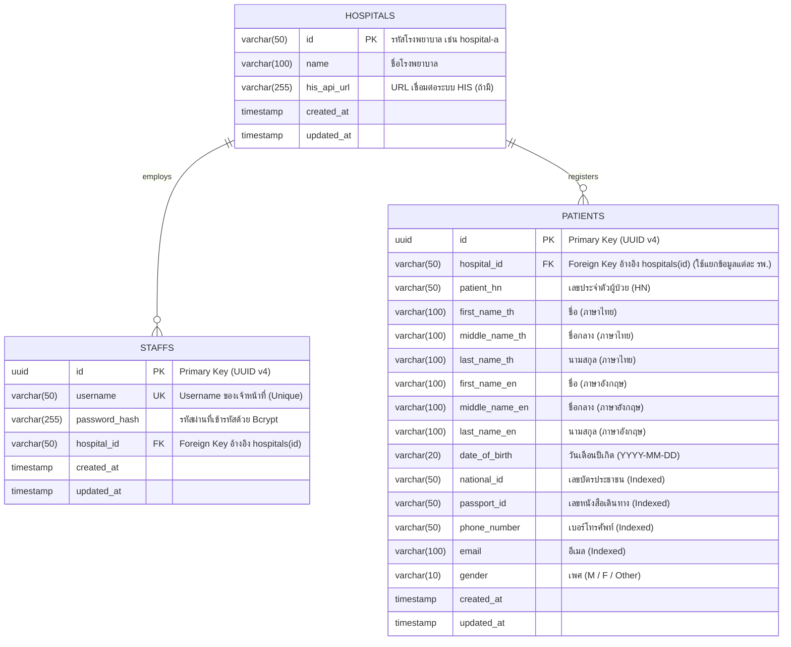

# เอกสาร Database Schema & ER Diagram - Hospital Middleware System

## 1. แผนภาพความสัมพันธ์ข้อมูล (Entity-Relationship Diagram)

---

## 2. รายละเอียดตารางในฐานข้อมูล

### 2.1 ตาราง `hospitals` (ข้อมูลโรงพยาบาล)
จัดเก็บข้อมูลโรงพยาบาลและ Endpoint เชื่อมต่อระบบ HIS
| คอลัมน์ (Column) | ชนิดข้อมูล | เงื่อนไข (Constraint) | คำอธิบาย |
|---|---|---|---|
| `id` | `VARCHAR(50)` | `PRIMARY KEY` | รหัสโรงพยาบาล (เช่น `hospital-a`, `hospital-b`) |
| `name` | `VARCHAR(100)` | `NOT NULL` | ชื่อโรงพยาบาล |
| `his_api_url` | `VARCHAR(255)` | `NULLABLE` | URL Endpoint สำหรับดึงข้อมูลจาก HIS ภายนอก |
| `created_at` | `TIMESTAMPTZ` | `DEFAULT NOW()` | วันเวลาที่สร้างข้อมูล |
| `updated_at` | `TIMESTAMPTZ` | `DEFAULT NOW()` | วันเวลาที่แก้ไขข้อมูลล่าสุด |

### 2.2 ตาราง `staffs` (ข้อมูลเจ้าหน้าที่)
จัดเก็บข้อมูลการเข้าสู่ระบบของเจ้าหน้าที่และโรงพยาบาลที่สังกัด
| คอลัมน์ (Column) | ชนิดข้อมูล | เงื่อนไข (Constraint) | คำอธิบาย |
|---|---|---|---|
| `id` | `UUID` | `PRIMARY KEY` | รหัสประจำตัวเจ้าหน้าที่ (UUID v4) |
| `username` | `VARCHAR(50)` | `UNIQUE, NOT NULL` | Username สำหรับเข้าสู่ระบบ |
| `password_hash` | `VARCHAR(255)` | `NOT NULL` | รหัสผ่านที่เข้ารหัสด้วย Bcrypt |
| `hospital_id` | `VARCHAR(50)` | `NOT NULL, FK` | Foreign Key ชี้ไปยัง `hospitals(id)` |
| `created_at` | `TIMESTAMPTZ` | `DEFAULT NOW()` | วันเวลาที่สร้างข้อมูล |
| `updated_at` | `TIMESTAMPTZ` | `DEFAULT NOW()` | วันเวลาที่แก้ไขข้อมูลล่าสุด |

### 2.3 ตาราง `patients` (ข้อมูลผู้ป่วย)
จัดเก็บข้อมูลประวัติผู้ป่วย รองรับโครงสร้างตามมาตรฐาน Hospital Information System
| คอลัมน์ (Column) | ชนิดข้อมูล | เงื่อนไข (Constraint) | คำอธิบาย |
|---|---|---|---|
| `id` | `UUID` | `PRIMARY KEY` | รหัสประจำตัวผู้ป่วย (UUID v4) |
| `hospital_id` | `VARCHAR(50)` | `NOT NULL, FK` | Foreign Key ชี้ไปยัง `hospitals(id)` (เพื่อแยกสิทธิ์เข้าถึงตามโรงพยาบาล) |
| `patient_hn` | `VARCHAR(50)` | `NOT NULL` | เลขประจำตัวผู้ป่วย (Hospital Number) |
| `first_name_th` | `VARCHAR(100)` | `NULLABLE` | ชื่อภาษาไทย |
| `middle_name_th` | `VARCHAR(100)` | `NULLABLE` | ชื่อกลางภาษาไทย |
| `last_name_th` | `VARCHAR(100)` | `NULLABLE` | นามสกุลภาษาไทย |
| `first_name_en` | `VARCHAR(100)` | `NULLABLE` | ชื่อภาษาอังกฤษ |
| `middle_name_en` | `VARCHAR(100)` | `NULLABLE` | ชื่อกลางภาษาอังกฤษ |
| `last_name_en` | `VARCHAR(100)` | `NULLABLE` | นามสกุลภาษาอังกฤษ |
| `date_of_birth` | `VARCHAR(20)` | `NULLABLE` | วันเดือนปีเกิด (YYYY-MM-DD) |
| `national_id` | `VARCHAR(50)` | `NULLABLE` | เลขบัตรประชาชน |
| `passport_id` | `VARCHAR(50)` | `NULLABLE` | เลขหนังสือเดินทาง |
| `phone_number` | `VARCHAR(50)` | `NULLABLE` | เบอร์โทรศัพท์ติดต่อ |
| `email` | `VARCHAR(100)` | `NULLABLE` | อีเมล |
| `gender` | `VARCHAR(10)` | `NULLABLE` | เพศ (`M`, `F`, `Other`) |
| `created_at` | `TIMESTAMPTZ` | `DEFAULT NOW()` | วันเวลาที่สร้างข้อมูล |
| `updated_at` | `TIMESTAMPTZ` | `DEFAULT NOW()` | วันเวลาที่แก้ไขข้อมูลล่าสุด |

---

## 3. ดัชนีและการแยกสิทธิ์ข้อมูล (Indexing & Multi-Tenancy Strategy)

เพื่อเพิ่มความเร็วในการสืบค้นข้อมูลและบังคับใช้การแยกสิทธิ์ระดับโรงพยาบาลอย่างเคร่งครัด ฐานข้อมูลจึงมีการสร้าง **Composite Index** ที่ขึ้นต้นด้วย `hospital_id` ทุกตัว:

- `idx_patients_hospital_id` บน `patients(hospital_id)`
- `idx_patients_hospital_hn` บน `patients(hospital_id, patient_hn)`
- `idx_patients_hospital_national_id` บน `patients(hospital_id, national_id)`
- `idx_patients_hospital_passport_id` บน `patients(hospital_id, passport_id)`
- `idx_patients_hospital_phone` บน `patients(hospital_id, phone_number)`
- `idx_patients_hospital_email` บน `patients(hospital_id, email)`
- `idx_patients_hospital_dob` บน `patients(hospital_id, date_of_birth)`
- `idx_patients_hospital_name_th` บน `patients(hospital_id, first_name_th, last_name_th)`
- `idx_patients_hospital_name_en` บน `patients(hospital_id, first_name_en, last_name_en)`
